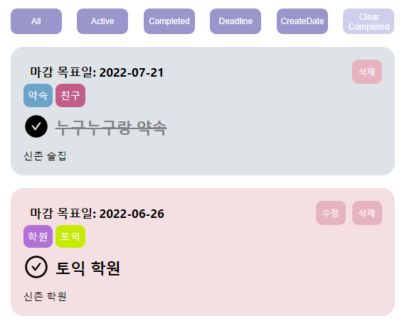
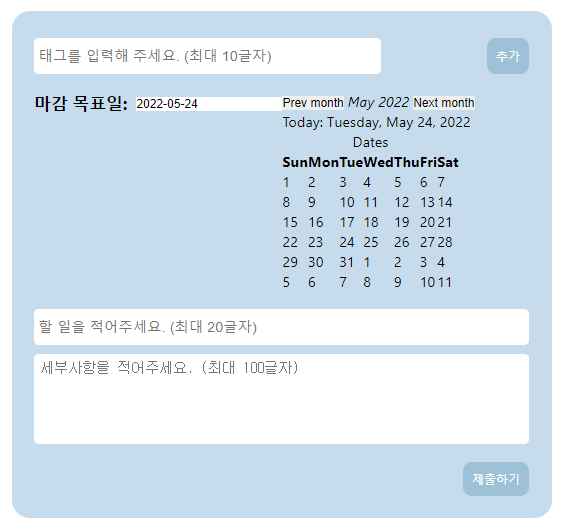
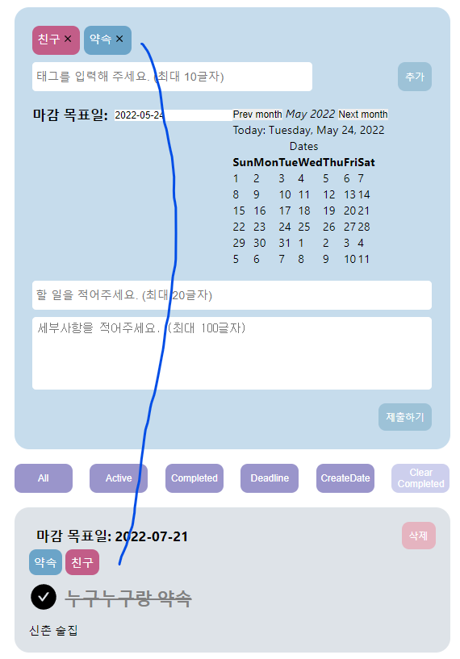

# 프로그라피 사전과제 제출물
#### 과제 공개는 불가

대충 TODO-LIST를 만드는 과제였는데 리액트의 기본적인 CRUD 구현 실력을 확인하는 
테스트였던 것 같음!

#### 화면 및 기능

* 태그를 포함한 TODO 일정을 추가할 수 있음

* 현재 이후 일정만 추가 가능

* 태그를 또 같은 이름으로 추가했을 때 색 통일

* 정렬 기능 종류
  * 남아있는 일정들 
  * 완료된 일정들
  * 마감 기한이 얼마 안남은 일정들
  * 만든 날짜별로
  * 완료된 일정 일괄 삭제
  * 모두보기
